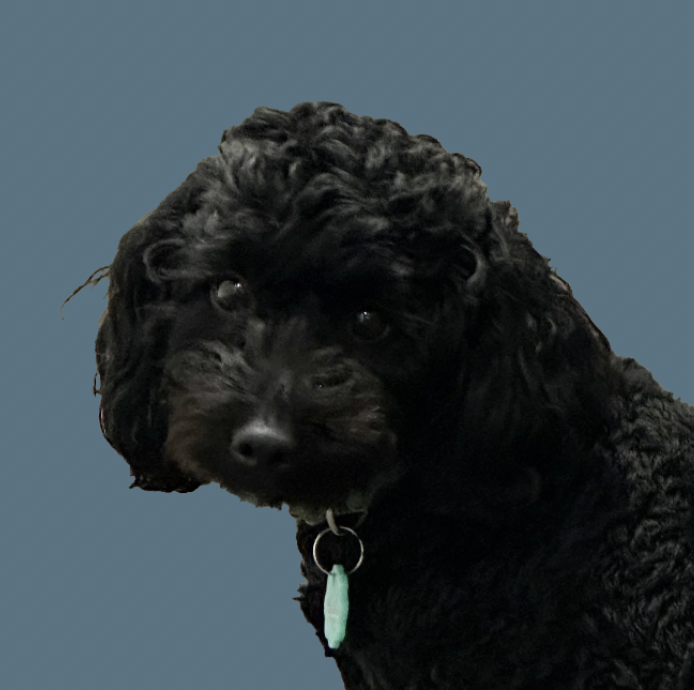

# Bogey

A tiny desktop companion for your Mac, based on a very good office dog.

> **Beta:** This is an early release. Expect a few rough edges, and feel free to report anything weird.

---

## What is Bogey?

You know him, you love him, now he can hang with you even when the real thing isnt around!
Bogey lives on your desktop. He wanders around, sits, sleeps, does tricks, and generally keeps you company while you work.

## Requirements

The app needs macOS 12 Monterey or newer, on either Apple Silicon or Intel Macs.

## Install

1. Download the latest `.dmg` from https://github.com/SmokierOcean/Bogey-Releases.
2. Open the downloaded file and drag **Bogey** into your **Applications** folder.

## First launch on macOS

Bogey is unsigned, which just means I haven't paid Apple's developer fee. macOS will warn you the first time you open it. This is expected and only happens once.

**To get past it:**

1. Right-click (or Control-click) the Bogey app in Applications and choose **Open**.
2. Click **Open** again in the dialog.

**If macOS still won't let you open it** (common on macOS Sequoia and later):

1. Try opening Bogey once so macOS blocks it.
2. Go to **System Settings → Privacy & Security**.
3. Scroll down and click **Open Anyway** next to the message about Bogey.
4. Confirm with your password if asked.

After that, Bogey opens normally like any other app.

## Using Bogey

- **Drag** Bogey around your screen to move him.
- **Click** Bogey to interact with him.
- right-click to select stay/go mode.
- Use the **menu bar icon** for options and to quit.

**Tricks:**

- **Pose** — Single click.
- **Who's Pilipino** — Double click.

## Updates

Bogey checks for updates and will show a little notice in the menu bar menu when a new version is available. Updates aren't automatic — you'll download and install the new version yourself from the Releases page.

## Uninstall

Quit Bogey from the menu bar icon, then drag the app from **Applications** to the Trash.

## Feedback

Found a bug or have an idea? Send me a message and a screenshot if aplicable. I would love your feedback!

## Credits

- Bogey is based on the best lil guy! 
- All art and design by Adam.
- Coding wizerdry by Claude

## License

[MIT](LICENSE)
